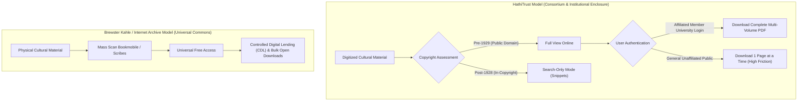
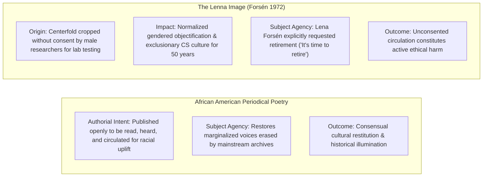
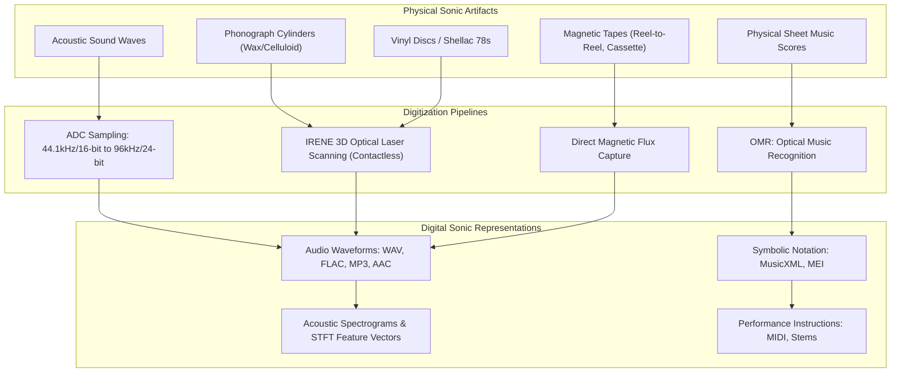

# Mass Digitization, Digital Libraries, and Data Retirement

**Course**: IS 310 — Culture As Data (Fall 2026)  
**Group**: Group A2  
**Semester Focus**: Music, Sound, and Audio Culture  
**Contributors**: Min Kim ([@lunana-7](https://github.com/lunana-7)), Darren Jin ([@ajjin513](https://github.com/ajjin513)), Rachel Tam ([@rtam721](https://github.com/rtam721)), Fianna Sullivan ([@fiannasullivan](https://github.com/fiannasullivan)), and Aoife  
**Date**: September 8, 2026  

---

## Executive Summary & Overview

This report investigates the computational, archival, and ethical lifecycles of cultural data. Moving from the large-scale scanning operations of **HathiTrust** and the **Internet Archive** to granular community-driven datasets like the **African American Periodical Poetry (1900–1928)** project, and confronting the ethical imperatives of data cessation highlighted by the **Lenna Image**, we explore how cultural expressions become digital surrogates, how those surrogates are structured into data, and under what conditions data should be refused, restricted, or retired. 

Building upon these foundational case studies, we extend our analysis to our group's semester focus—**Music, Sound, and Audio Culture**—examining audio waveforms, Optical Music Recognition (OMR), streaming enclosures, sonic copyright, and Indigenous sound refusal protocols.

---

## Part 1: Exploring HathiTrust: Digitization in Practice

### 1. Finding the African American Periodical Poetry

Using the [Hennessey & Singh dataset (Lehigh University / *Responsible Datasets in Context*)](https://www.responsible-datasets-in-context.com/posts/african-american-periodical-poetry/aa-periodical-poetry.html) containing 983 poems across 28 historical periodicals, we selected three distinct poems published across three different magazine venues:

| # | Poem Title | Poet | Periodical / Venue | Publication Date | Physical Location in Issue | HathiTrust Record / Access Status |
| :- | :--- | :--- | :--- | :--- | :--- | :--- |
| **1** | *"The Negro Speaks of Rivers"* | **Langston Hughes** | *The Crisis: A Record of the Darker Races* | June 1921 (Vol. 22, No. 2) | Page 71 (Issue Page 17) | [HathiTrust Catalog Record 101643349](https://catalog.hathitrust.org/Record/101643349) / [Record 000523098](https://catalog.hathitrust.org/Record/000523098) — **Full View (Public Domain)** |
| **2** | *"Heritage"* | **Gwendolyn B. Bennett** | *Opportunity: A Journal of Negro Life* | December 1923 (Vol. 1, No. 12) | Page 371 | [HathiTrust Catalog Record 000505963](https://catalog.hathitrust.org/Record/000505963) — **Full View (Vol. 1 Public Domain)** |
| **3** | *"Japanese Hokku Poems"* | **Lewis Alexander** | *Black Opals* | Christmas/Dec 1927 (Vol. 1, No. 3) | Page 9 | **Not in Full View on HathiTrust** (Only preserved in specialized archives / bespoke recovery collections) |

#### Search Strategies
1. **Catalog Title & Serial Indexing**: We first queried the HathiTrust catalog using journal titles (*The Crisis*, *Opportunity*, *Black Opals*) combined with year and volume numbers.
2. **ISSN & Subject Search**: For serial publications, title-level searches frequently returned hundreds of unrelated records or library holdings catalogs. Searching via standard ISSN (e.g., `0011-1422` for *The Crisis*) and Library of Congress Subject Headings narrowed down serial runs.
3. **Full-Text Phrase Search**: Within specific digitized bound volumes, we utilized the internal volume search tool to search exact author names and title strings (e.g., `"Negro Speaks of Rivers"`, `"Gwendolyn Bennett"`, `"I want to see the slim palm-trees"`).

#### Successes, Failures, and Archival Barriers
* **Serial Aggregation Barrier (The Bound Volume Problem)**: In HathiTrust, periodicals are almost never cataloged or displayed as individual monthly issues. Instead, university libraries bound 6 to 12 months into thick, consolidated annual volumes before shipping them to Google or Internet Archive scanning centers. Consequently, a user cannot simply click "June 1921"; one must locate "Volume 21–22 (1921)", inspect the pagination scheme (which either numbers consecutively across all 300+ pages of the volume or resets each issue), and manually navigate to the target issue.
* **The "Little Magazine" Archival Silence**: While major publications backed by national civil rights organizations (*The Crisis* by the NAACP, *Opportunity* by the National Urban League) were collected by major university libraries (Harvard, Michigan, California) and thus ingested into HathiTrust, *Black Opals*—a Philadelphia modernist "little magazine" with a tiny print run of approximately 250 copies—was completely absent from HathiTrust full-view. Mass digitization pipelines systematically reflect the historical acquisition biases of large research universities; rare, localized, ephemeral Black print culture was excluded from mass scanning and survives primarily in dedicated physical repositories (the Schomburg Center for Research in Black Culture, the Free Library of Philadelphia) or bespoke digital humanities projects (Amardeep Singh’s Lehigh digital anthology).

---

### 2. Examining OCR Quality

| OCR Dimension | Findings from HathiTrust Scans | Direct Implications for Cultural & Computational Research |
| :--- | :--- | :--- |
| **Searchability** | Exact phrase searches succeed on clean, modern type, but fail when lines contain historical ligature characters, drop caps, or hyphenated breaks. | Distant reading algorithms relying on exact string matching miss significant portions of texts. |
| **Visual Accuracy** | OCR text for *The Crisis* and *Opportunity* yields an estimated 85%–92% character accuracy on body prose, but drops significantly on poetry due to line breaks, varied indentations, and non-standard layouts. | Computational counts of meter, rhyme schemes, and stanza counts cannot rely on raw OCR without human curation. |
| **Prominent Error Typologies** | **1. Multi-Column Reading Order Errors**: Periodicals formatted with two or three columns per page often cause OCR engines to read horizontally across column boundaries, splicing lines from adjacent articles or ads into the poem.<br>**2. Drop Capitals**: Large decorative initial letters (e.g., the stylized "I" beginning *"I've known rivers"*) are misrecognized as vertical bars (`|`), slashes (`/`), or omitted entirely.<br>**3. Ink Bleed & Paper Aging**: Thin 1920s paper stock exhibits show-through from reverse pages, turning commas into semicolons and generating phantom periods.<br>**4. Font Artifacts**: Harlem Renaissance display typefaces and italicized bylines are frequently garbled into alphanumeric noise (e.g., *"Hughes"* parsed as *"Hnghes"*, *"Du Bois"* parsed as *"Dn Bois"*). | Keyword-in-context (KWIC) concordances become corrupted; statistical topic models infer spurious topics based on repeated OCR noise tokens; minoritized or lesser-known authors whose names are garbled become completely invisible to algorithmic retrieval. |

> [!WARNING]
> **Research Implication**: Uncritical use of mass-digitized OCR in historical research creates a severe survivorship bias. Well-known authors whose names and works appear in pristine print are consistently indexed, while marginalized writers printed on lower-grade paper or in experimental typography are mathematically erased by the OCR pipeline.

---

### 3. Understanding Context: Periodical Pages vs. Structured Datasets

```
+-------------------------------------------------------------------------------+
|                       MATERIAL PERIODICAL PAGE CONTEXT                        |
|                                                                               |
|  [Header: The Crisis - A Record of the Darker Races - June 1921]              |
|                                                                               |
|  +---------------------------+  +------------------------------------------+  |
|  | EDITORIAL BY W.E.B. DU BOIS|  | POEM: "The Negro Speaks of Rivers"       |  |
|  | Political analysis of race|  | by Langston Hughes                       |  |
|  | riots and disenfranchised |  |                                          |  |
|  | Black Southern veterans.  |  | "I've known rivers:                      |  |
|  +---------------------------+  |  I've known rivers ancient as the world  |  |
|                                 |  and older than the flow of human blood  |  |
|  +---------------------------+  |  in human veins..."                      |  |
|  | NAACP INVESTIGATION       |  +------------------------------------------+  |
|  | Monthly lynching statistic|                                                |
|  | and legal defense fund.   |  +------------------------------------------+  |
|  +---------------------------+  | COMMERCIAL ADVERTISEMENT                 |  |
|                                 | Madame C.J. Walker beauty preparations   |  |
|                                 | and Howard University enrollment drive.  |  |
|                                 +------------------------------------------+  |
+-------------------------------------------------------------------------------+
                                        |
               MASS DIGITIZATION & DATASET EXTRACTION PIPELINE
                                        v
+-------------------------------------------------------------------------------+
|                      HENNESSEY & SINGH STRUCTURED DATASET                     |
|                                                                               |
|  title: "The Negro Speaks of Rivers"                                          |
|  author (first last): "Langston Hughes"                                       |
|  venue: "The Crisis"                                                          |
|  month: "June" | year: "1921" | Magazine Type: "Black Periodical"             |
|  themes: "Race: Identity formation; African Heritage; Rivers"                 |
|  text: "I've known rivers: / I've known rivers ancient as the world..."       |
+-------------------------------------------------------------------------------+
```

#### What Was Lost in Creating the Structured Dataset
* **Spatial and Ideological Juxtaposition**: In *The Crisis*, Hughes’s lyric poem is situated directly adjacent to W.E.B. Du Bois’s scathing socio-political editorials and grim NAACP reports documenting racial terror and lynchings. Reading the poem in isolation strips away its functional role as a radical aesthetic counterweight to anti-Black violence.
* **Visual Materiality & Commercial Ecology**: Original pages contain cover artwork, hand-drawn woodcut illustrations (by artists such as Aaron Douglas and Allan Randall Freelon), typography, and advertisements for Black-owned businesses, hair care products, sheet music, and historically Black colleges. These elements illustrate the economic ecosystem that funded the Harlem Renaissance.

#### What Was Gained by Creating the Structured Dataset
* **Computational Actionability**: The Hennessey dataset transforms unsearchable page images into structured tabular data (`.csv`), enabling immediate querying across 983 poems, cross-tabulating author gender against venue types, and charting historical publication spikes between 1900 and 1928.
* **Recovery of Obscure Voices**: Mass digitization indexes magazines by title, leaving unindexed authors hidden. By hand-curating the dataset, the researchers identified and attributed poems by over 70 unverified or forgotten poets whose work would otherwise remain buried in bound volumes.
* **Crossover Venue Analysis**: The structured tagging allows researchers to computationally analyze how Black authors were received in predominantly white modernist periodicals (*Survey Graphic*, *Palms*, *The Carolina Magazine*) versus Black radical publications.

---

### 4. Access and Rights: HathiTrust vs. Universal Access



#### Viewing Options, Restrictions, and Copyright Realities
* **Viewing Modes**: On HathiTrust, public domain works (pre-1929 under U.S. copyright law) are accessible in **"Full View"**. However, volumes published after 1928 or those with ambiguous copyright renewal histories are restricted to **"Search Only"**, functioning merely as an index that confirms word occurrence without showing the underlying page image.
* **Download Restrictions**: Even for public domain works, HathiTrust enforces a strict two-tier access hierarchy:
  - *Affiliated Users* (students, staff, and faculty of HathiTrust partner institutions who log in via institutional SSO) can download complete book PDFs in a single click.
  - *Unaffiliated Public Users* are denied full-book downloads and are restricted to downloading single-page PDFs one at a time, introducing deliberate friction that prevents bulk downloading.
* **Balancing Preservation, Access, and Law**: HathiTrust's model is explicitly risk-averse, shaped by the *Authors Guild v. HathiTrust* legal battle. Rather than challenging copyright boundaries, HathiTrust guarantees fair use through non-consumptive computational research (via the HathiTrust Research Center - HTRC) while strictly fencing full-text reading behind verified public domain cutoffs and member subscriptions.
* **Kahle’s Universal Access Critique**: Brewster Kahle’s foundational 2007 essay, *"Universal Access to All Knowledge,"* articulates a radically different vision inspired by the Library of Alexandria: all published human knowledge should be universally accessible to every person on Earth with an internet connection, completely free of charge. Kahle argues that locking digital collections behind institutional university paywalls replicates the aristocratic gatekeeping of the print era. While HathiTrust prioritizes legal compliance and university institutional sustainability, Kahle’s Internet Archive prioritizes universal democratized access—a stance that has led to aggressive legal retaliation from commercial publishing cartels (e.g., *Hachette v. Internet Archive*).

---

### 5. Metadata and Organization: MARC 21 vs. Granular Cultural Datasets

| Metadata Field | HathiTrust Catalog Record (MARC 21 Standard) | African American Periodical Poetry Dataset | Critical Evaluation & Scholarly Utility |
| :--- | :--- | :--- | :--- |
| **Entity Level** | **Serial / Container Level**<br>(Describes the journal as a whole, e.g., *"The Crisis, volumes 21-22"*) | **Item / Component Level**<br>(Describes each individual poem, author, and stanza independently) | MARC completely obscures individual cultural objects within periodicals. A researcher searching for a poem cannot find it through HathiTrust catalog metadata alone. |
| **Subject Tagging** | **Broad LCSH Standard**<br>(e.g., `African Americans -- Periodicals`, `United States -- Race relations`) | **Curated Cultural & Political Themes**<br>(e.g., `Lynching and Racialized Violence`, `Black Beauty`, `Pan-Africanism`, `Motherhood`, `World War I`) | LCSH reflects colonial, institutional library classification practices. The dataset introduces domain-specific, justice-oriented metadata that captures the thematic nuances of the Harlem Renaissance. |
| **Social & Gender Context** | None (Serial records do not capture contributor identities) | Explicit tracking of author gender, pseudonyms, and unverified biographies | Essential for intersectional feminist analysis, revealing the high proportion of women poets published in *The Crisis* and *Opportunity*. |
| **Institutional Affiliation** | Standard Library of Congress control numbers, OCLC numbers, Dewey decimal | Venue classifications: Black Periodical vs. White Crossover Venue | Enables sociolinguistic and socio-literary analysis of how Black authors adapted their rhetoric for white versus Black readerships. |

#### Alternative Dataset Organization Proposals
If redesigning the dataset infrastructure, we propose a **Linked Open Data (LOD) relational graph model**:
1. **IIIF Integration**: Linking each row directly to a persistent IIIF (International Image Interoperability Framework) deep-zoom image URL, allowing researchers to computationally inspect the original typography without leaving the analytical environment.
2. **Authority URI Disambiguation**: Connecting each author entity to persistent Wikidata and VIAF identifiers to disambiguate pseudonyms and link historical poets to modern encyclopedic knowledge bases.
3. **Formal Poetic Encoding**: Incorporating TEI-XML (Text Encoding Initiative) stanza- and meter-level markup to support computational prosody and rhyme analysis alongside social justice thematic tags.

---

### 6. Data Retirement and Consent: African American Periodical Poetry vs. The Lenna Image

In *"Can Data Die? Tracking the Lenna Image"* (The Pudding, October 2021), Jennifer Ding, Jan Diehm, and Michelle McGhee trace the pervasive circulation of "Lenna"—a 512×512 pixel crop of Swedish model Lena Forsén’s November 1972 *Playboy* centerfold, scanned in 1973 by male engineers at the USC Signal and Image Processing Institute (SIPI). This case provides a critical counterpoint to the ethical stewardship of cultural datasets:



#### Why Periodical Poetry Represents Responsible Access
The poets published in *The Crisis*, *Opportunity*, and *Black Opals* deliberately submitted their writings to public cultural periodicals as acts of political testimony, racial uplift, and public literary engagement. Making these digitized texts discoverable honors authorial intent, counters historic archival erasure, and restores African American intellectual labor to the digital record.

#### Why Lenna Constitutes Unconsented Harm
In contrast, Lena Forsén never consented to having her nude photograph cropped, digitized, distributed as a benchmark, or printed across thousands of computer engineering textbooks. For half a century, the ubiquitous presence of a *Playboy* pin-up as the canonical test image in computer science classrooms normalized a sexually objectifying, hostile environment for women entering technical fields. In 2019, Forsén explicitly stated her desire to be removed from tech literature: *"They must be so tired of me... It’s time for me to retire from tech."* Continuing to circulate Lenna as an engineering default directly violates the ethical autonomy of the living subject.

#### What Data Retirement Means in Practice
For a cultural object, benchmark dataset, or classroom example to **"retire"** means moving beyond passive neglect toward active institutional de-commissioning:
1. **Institutional Refusal & Policy Bans**: In April 2024, the IEEE (Institute of Electrical and Electronics Engineers) formally banned the submission of new papers utilizing the Lenna image in any of its journals and conferences.
2. **Benchmark Replacement**: Transitioning machine learning and signal processing curricula to ethical, public-domain, or synthetic test suites (such as modern standardized photographic benchmarks created with explicit, informed model consent).
3. **Deprecation Documentation**: Rather than silently deleting historical entries (which erases the disciplinary history of harm), archival entries should display clear **Takedown & Retraction Notices** explaining *why* the data was retired.
4. **Machine-Readable Refusal Metadata**: Datasets must integrate machine-readable refusal flags (e.g., within *Datasheets for Datasets* or Dublin Core rights extensions) that prevent automated web scrapers from ingesting retired assets into generative AI foundation models.

---

## Part 2: Discovering & Digitizing Cultural Objects: Music & Sound Data

Having examined the digitization of historical text, we now extend our inquiry into Group A2’s domain of focus: **Music, Sound, and Audio Culture**.



---

### 1. Digital Objects & Representations in Music

In music, a "digital object" is fundamentally multi-modal. Unlike printed text, which is represented by discrete alphanumeric character strings (ASCII/Unicode), music exists simultaneously as **continuous acoustic phenomena**, **symbolic performance instructions**, and **semantic metadata**:

1. **Uncompressed & Lossless Audio Waveforms (WAV, AIFF, FLAC)**: Binary numeric representations of acoustic pressure variations over time, sampled at discrete intervals (e.g., 44,100 or 96,000 samples per second). These represent the physical acoustic performance.
2. **Compressed Perceptual Codecs (MP3, AAC, Ogg Vorbis)**: Psychoacoustically stripped audio data that discards frequencies deemed imperceptible to human ears to reduce file sizes for digital streaming.
3. **Symbolic Score Encodings (MusicXML, MEI - Music Encoding Initiative)**: Machine-readable XML structures representing musical notation—pitch, duration, key signatures, slurs, and dynamics—independent of any specific audio recording.
4. **Protocol & Performance Instruction Streams (MIDI - Musical Instrument Digital Interface)**: Symbolic event data recording note-on, note-off, velocity, pitch-bend, and control changes, acting as instructions for digital synthesizers rather than raw sound.
5. **Time-Frequency Acoustic Representations (Spectrograms, STFT, Mel-Frequency Cepstral Coefficients [MFCCs])**: Visual and mathematical matrices decomposing sound into frequency bands over time, widely used in Music Information Retrieval (MIR) and audio AI training.
6. **Isolated Stems & Multitracks**: Independent audio streams for individual instruments (vocals, drums, bass, synths) exported from a production session, allowing interactive remixing and re-spatialization (e.g., Dolby Atmos stems).

---

### 2. Digitization Processes: Audio & Music vs. Textual HathiTrust Scans

| Digitization Stage | Textual Digitization (HathiTrust / Google Books) | Sonic & Musical Digitization (Audio & Sheet Music) |
| :--- | :--- | :--- |
| **Primary Capture Mechanism** | Planetary or flatbed overhead cameras capturing reflected visible light at 300–600 DPI. | **1. ADC (Analog-to-Digital Conversion)**: Electronic transducers converting electrical voltage from magnetic heads or phonograph needles into binary values governed by the Nyquist-Shannon sampling theorem.<br>**2. Optical Non-Contact Scanning (IRENE System)**: High-resolution 3D confocal microscope cameras optically scanning the physical grooves of damaged or fragile wax cylinders and shellac discs without touching them with a needle. |
| **Data Extraction / Translation** | **OCR (Optical Character Recognition)**: Translates 2D raster character shapes into 1D linear character strings. | **1. OMR (Optical Music Recognition)**: Translates 2D graphical musical notation into symbolic MusicXML/MEI data.<br>**2. Audio Feature Extraction**: Fast Fourier Transforms (FFT) parsing raw audio into pitch, tempo, chroma, and harmonic vectors. |
| **Error Rates & Complexity** | Linear reading order, fixed vocabularies, dictionary lookups reduce ambiguity. | **Extremely High Error Rates**: OMR must simultaneously parse two-dimensional polyphony, overlapping noteheads, clefs, accidentals, beams, dynamic markings, and expressive tempo text. While OCR failure produces misspelled words, OMR failure alters pitch, rhythm, and structural playback, rendering scores musically illiterate. |
| **Physical Degradation Risks** | Acidic paper yellowing, brittleness, binding tightness. | Vinegar syndrome in magnetic tape, groove wear from steel needles, surface mold on wax cylinders, warping of lacquer acetate discs, and tape shedding (requiring literal "tape baking" before playback). |

---

### 3. Historical Equivalents to Digital Music Objects

Brewster Kahle repeatedly invoked the ancient **Library of Alexandria** as the physical archetype of universal knowledge aggregation. In the realm of sound and music, physical antecedents have long attempted to preserve sonic culture across media shifts:

* **Ancient Greek Hymn Papyri & Stone Inscriptions (e.g., Seikilos Epitaph, c. 200 BCE–100 CE)**: Ancient Greek musical notation carved on stone or papyrus scrolls held in Hellenistic libraries represents the earliest surviving attempts to store musical pitch and duration as external data.
* **Medieval Monastic Antiphonaries & Neumatic Codices (e.g., St. Gall Cantatorium, 9th Century)**: Hand-illuminated parchment manuscripts documenting Gregorian chants using adiastematic neumes (gestural melodic contours). Like modern MIDI or MusicXML, they encoded melodic gestures, but relied on oral tradition for exact pitch decoding.
* **Perforated Player Piano Rolls (Late 19th–Early 20th Century)**: Mechanical paper rolls punched with physical perforations that actuated pneumatic player pianos. Piano rolls are the direct physical ancestors of modern digital MIDI piano rolls, discretely encoding note pitch, start time, and duration.
* **Ethnographic Field Cylinder Archives (Frances Densmore, Alan Lomax, 1890s–1930s)**: Wax cylinder and acetate disc collections created by ethnomusicologists documenting Indigenous, folk, and African American musical traditions. Like modern mass digitization drives, these expeditions attempted to capture all human sonic expression, often extracting sacred community knowledge without enduring consent.

---

### 4. Born-Digital Materials in Music

**Born-digital** musical materials are those conceived, produced, and existing natively in binary computational environments, possessing no prior physical or analog manifestation:

1. **Digital Audio Workstation (DAW) Session Files (`.als` Ableton, `.flp` FL Studio, `.logicx` Logic Pro)**: Complex multi-track session files combining recorded audio clips, virtual instrument automation curves, MIDI arrangements, and digital signal processing (DSP) chains.
2. **Virtual Studio Technology (VST) Plugins & Synthesizer Presets**: Code-level DSP algorithms and parameter configuration files that generate timbre mathematically (e.g., Serum, Massive presets).
3. **Generative & Neural Audio Models (Suno, Udio, MusicLM)**: Latent space weights, prompts, and synthetic audio outputs generated directly by machine learning foundation models trained on millions of musical recordings.
4. **Chiptunes & Module Tracker Files (`.mod`, `.xm`, `.it`)**: Historical 1980s/1990s tracker files that combined small digital audio sample waveforms with procedural assembly-level sequencing code to produce dynamic sound within strict computer memory limits (e.g., Amiga, Commodore 64).

#### The Born-Digital Preservation Paradox: "Software Dependency Hell"
While physical vinyl records can be played with a simple needle and paper cone 100 years from now, **born-digital music is exceptionally fragile**. A 2008 Ableton Live session cannot be opened or played correctly in 2026 if the host operating system has deprecated 32-bit architecture, if the proprietary VST synthesizer licenses have expired, or if digital rights management (DRM) authorization servers have been shut down. Preserving born-digital music requires emulating entire computing environments rather than merely preserving static files.

---

### 5. The Oldest Digital Music Archives

* **UCSB Cylinder Audio Archive (University of California, Santa Barbara)**:
  - *Origins*: Established in the early 2000s, this represents one of the oldest systematic digital audio libraries in the world, holding over 10,000 digitized phonograph wax and celluloid cylinders spanning the 1890s through the 1920s.
  - *Maintenance & Standards*: Continuously migrated from early RealAudio and low-bitrate MP3 formats into high-resolution 24-bit/96kHz broadcast WAV master files.
  - *Metadata*: Cataloged under Dublin Core and MODS standards, providing details on cylinder manufacturer (Edison, Columbia), take numbers, physical condition, and performer histories.
* **IMSLP / Petrucci Music Library (International Music Score Library Project)**:
  - *Origins*: Founded in 2006 by Edward W. Guo, IMSLP is the musical counterpart to Project Gutenberg and HathiTrust, dedicated to mass-digitizing public domain musical scores.
  - *Holdings*: Preserves over 500,000 sheet music scores and 70,000 audio recordings across 25,000 composers.
  - *Metadata & Governance*: Utilizes a MediaWiki-based collaborative framework with strict legal copyright review teams categorizing scores according to jurisdictional copyright laws (Canada 50-year rule, US 95-year rule, EU 70-year post-mortem rule).

---

### 6. The Newest Digital Music Archives: Semantic & AI-Scale Repositories

* **MusiCaps & Hugging Face Audio Datasets (2023–Present)**:
  - *Architecture*: Modern machine learning audio repositories developed for training generative models (e.g., Google’s MusiCaps dataset on Hugging Face).
  - *Metadata Contrast*: Older archives like UCSB or HathiTrust rely on traditional bibliographic cataloging (Title, Composer, Date, Publisher). Newest AI-scale audio archives catalog music through **dense semantic descriptions, acoustic feature vectors, BPM, musical key, instrument tags, and text prompts** paired with 10-second high-fidelity audio tokens.
* **Bandcamp Community Archive & The Free Music Archive 2.0 (FMA)**:
  - Modern independent audio repositories utilizing **JSON-LD, MusicBrainz persistent global identifiers, and Creative Commons machine-readable licensing**. They support direct community upload, lossless audio distribution, and decentralized web archiving.

---

### 7. Viral Cultural Phenomenon: The Amen Break

The ultimate case study of a digitized sonic object going viral is the **Amen Break**:

```
1969: "Amen, Brother" by The Winstons (Drummer: Gregory Coleman)
[4-bar, 6-second drum break recorded on analog magnetic tape]
                           |
                     Digitization (1980s)
                           |
                           v
Sampled into early E-mu SP-1200 & Akai S950 digital samplers
                           |
+--------------------------+--------------------------+
|                          |                          |
v                          v                          v
Hip-Hop Genesis        Jungle & Drum'n'Bass      Breakcore & Modern Pop
(N.W.A., "Straight     (UK Rave Culture,         (The Prodigy, Aphex Twin,
Outta Compton")        Goldie, Shy FX)           TikTok Speed-Up Trends)
                           |
                           v
Over 6,000+ commercial tracks globally registered
                           |
                     Ethical Crisis:
Gregory Coleman died homeless in 2006, never having received
a single penny in royalties from the global mass-circulation of his sound.
```

The mass digitization and computational sampling of the Amen Break birthed entire global musical genres (Jungle, Drum & Bass, Breakcore). However, it represents a catastrophic failure of data compensation and attribution: a 6-second digital snippet was copied, stretched, and commercialized across a multi-million-dollar music industry while its Black creator died in poverty.

---

### 8. Free vs. Proprietary Digital Music Libraries

| Feature / Dimension | Public Commons Archives<br>(IMSLP, Internet Archive Live Music Archive) | Proprietary Streaming Enclosures<br>(Spotify, Apple Music, Tidal) |
| :--- | :--- | :--- |
| **Ownership vs. Access** | **Public Ownership**: Users download open files (PDF, FLAC, MP3) directly to local storage for perpetual ownership and offline study. | **Rented Access**: Users license temporal streaming access; files are encrypted behind proprietary DRM (FairPlay, Widevine) and cannot be owned or exported. |
| **Monetization & Labor** | Non-profit, donor-supported, volunteer-curated, Creative Commons licensing. | Corporate rentier capitalism; artists receive fractional fractions of a cent ($0.003–$0.005) per stream dictated by opaque algorithmic playlist payola. |
| **Preservation Vulnerability** | Precarious non-profit funding and aggressive legal attacks from commercial rights holders. | **Platform Disappearance**: Entire discographies, regional mixes, and independent releases vanish overnight when licensing contracts expire or master owners pull catalogs. |
| **Metadata Openness** | Open, downloadable, interoperable XML, MARC, and Wiki records. | Proprietary, closed black-box APIs; user listening data is extracted and weaponized for surveillance advertising. |

---

### 9. Retirement, Refusal, and Restricted Access in Sound

Just as the Lenna Image demonstrates that visual data must sometimes be retired, the sonic realm contains urgent imperatives for **data refusal, access restriction, and repatriation**:

#### 1. Indigenous Sacred Ceremonial Audio & The CARE Principles
Early anthropologists (such as Jesse Walter Fewkes and Frances Densmore) recorded sacred Native American, First Nations, and Australian Aboriginal ceremonies, funeral songs, and seasonal rites onto wax cylinders without informed, collective tribal consent. 
* Under Indigenous Data Sovereignty frameworks and the **CARE Principles (Collective Benefit, Authority to Control, Responsibility, Ethics)**, these recordings **must not circulate freely on public platforms like the Internet Archive or HathiTrust**.
* **Traditional Knowledge (TK) Labels**: Contemporary digital archives (such as the *Mukurtu CMS* platform developed with Indigenous communities) implement **TK Labels**—machine-readable cultural metadata protocols that restrict audio playback based on clan membership, gender, and sacred season (e.g., songs that may only be heard during winter ceremonies).

#### 2. Non-Consensual Voice Cloning & Posthumous AI Releases
The rapid rise of voice-conversion AI models (e.g., the viral 2023 fake Drake/The Weeknd track *"Heart on My Sleeve"* by Ghostwriter977, and posthumous AI albums generated from deceased artists like Juice WRLD and Tupac Shakur) creates deep ethical harm:
* The vocal timbre and biometric identity of a human being are extracted from legacy recordings without consent.
* **Responsible Documentation Mandate**: Archival standards and AI audio datasets must incorporate **Biometric Provenance & Voice Refusal Tags**, explicitly documenting whether an artist granted legal and ethical consent for synthetic voice training, and enforcing immediate takedown protocols when unconsented voice datasets are deployed.

---

## Part 3: Documenting & Synthesizing Findings

### 1. The Tripartite Synthesis: Mass Digitization, Dataset Documentation, and Data Retirement

```
                     MASS DIGITIZATION
              (Scale, Extraction, Ingestion)
               HathiTrust / Internet Archive
               "Digitize Everything at Speed"
                           /    \
                          /      \
                         /        \
                        /          \
                       v            v
DATASET DOCUMENTATION <--------------> DATA RETIREMENT
 (Labor, Curation, Context)         (Consent, Refusal, Cessation)
 Hennessey Periodical Poetry         Lenna / TK Sacred Sound Labels
 "What choices made this usable?"    "When must the data stop?"
```

The three assigned readings and our hands-on explorations reveal that **Mass Digitization, Dataset Documentation, and Data Retirement form an inseparable, interdependent lifecycle**:

1. **The Incompleteness of Mass Digitization**: Mass digitization (as championed by Brewster Kahle and executed by Google/HathiTrust) operates on industrial extraction—scanning millions of bound volumes to build a digital Library of Alexandria. However, mass scanning alone produces brittle, error-ridden OCR, flattens multi-modal complexity, and systematically reproduces historical biases (such as the disappearance of small-press Black periodicals like *Black Opals* or the sonic erasure of oral traditions).
2. **The Human Necessity of Dataset Documentation**: Raw digitized archives cannot be responsibly utilized for cultural research without intentional curation. As Singh and Hennessey demonstrate, transforming mass scans into a usable cultural dataset requires immense interpretative labor: correcting OCR noise, identifying authors, classifying gender, and tagging themes. Dataset documentation makes the politics of extraction visible, illuminating the trade-off between the material richness of the original page and the computational utility of tabular data.
3. **The Ethical Boundary of Data Retirement**: Without mechanisms for data retirement, mass digitization becomes an engine of permanent, unconsented exploitation. As Ding, Diehm, and McGhee illustrate through the Lenna Image, and as Indigenous sound archives demonstrate through sacred audio recordings, the capacity to collect and preserve does not grant an unconditional right to circulate. Responsible digital libraries must possess protocols not only for ingestion and cataloging, but for **refusal, restriction, and sunsetting**.

---

### 2. Synthesis for Class Discussion

#### One Key Finding
> **The Bound-Volume Friction**: Mass digital libraries like HathiTrust are architecturally designed around the **aggregate physical container** (the library-bound annual serial volume) rather than the **lived cultural object** (the individual poem, illustration, musical track, or monthly issue). This creates an immense structural barrier for digital humanities research, requiring scholars to manually build intermediate, curated datasets (like Hennessey's) to make cultural expressions computationally discoverable.

#### One Unresolved Problem / Tension
> **The Preservation-Context Paradox**: In both text and music, making cultural artifacts machine-actionable (converting poems to clean CSV rows, or sheet music to MusicXML, or vinyl grooves to isolated MFCC vectors) inevitably strips away the material, visual, and sociopolitical context that gave them meaning (Du Bois's adjacent lynching editorials, commercial advertisements, album liner notes, and communal performance acoustics). How can digital archives preserve the computational utility of data without severing the material fabric that grounds cultural truth?

#### One Question for Class Discussion
> *"How can global digital library architectures accommodate dynamic 'data retirement' and 'cultural refusal' protocols when our underlying digital preservation infrastructure is fundamentally engineered around immutable, permanent identifiers (DOIs, ARKs, ISBNs, and immutable decentralized archives)?"*

---

## Dividing Labor & Collaborative Git Logging

In accordance with course guidelines, Group A2 divided project responsibilities equitably across all five research areas, utilizing GitHub commit logs to maintain transparent accountability:

### Work Allocation Matrix

| Group Member | Primary Responsibilities & Contributions | Git Log Verifiable Commit Scope |
| :--- | :--- | :--- |
| **Min Kim** ([@lunana-7](https://github.com/lunana-7)) | **Research Lead & Technical Architecture**: Project setup, root repository architecture, HathiTrust hands-on exploration (*The Crisis*, *Opportunity*, *Black Opals*), OCR error taxonomy, and Music digital object technical analysis. | Repository initialization, root `README.md`, HathiTrust query log, OCR documentation. |
| **Darren Hong** ([@ajjin513](https://github.com/ajjin513)) | **Archival & Rights Specialist**: Investigating HathiTrust access tiers, copyright cutoffs, download friction, and comparative analysis with Brewster Kahle’s "Universal Access to All Knowledge" philosophy and streaming copyright enclosures. | Access and rights analysis, Kahle comparative synthesis, HathiTrust legal matrix, streaming licensing analysis. |
| **Rachel Tam** ([@rtam721](https://github.com/rtam721)) | **Music Data & Metadata Specialist**: Investigation of audio digitization pipelines (ADC, IRENE optical laser scanning, OMR vs. OCR), born-digital DAW preservation, acoustic representations, and MusicBrainz / Linked Open Data standards. | Music digitization analysis, born-digital preservation paradox, audio representations, semantic metadata standards. |
| **Fianna Sullivan** ([@fiannasullivan](https://github.com/fiannasullivan)) | **Synthesis & Discussion Coordinator**: Developing the overarching tripartite synthesis (Mass Digitization / Documentation / Retirement), drafting key findings, and formulating class discussion questions and tension points. | Tripartite synthesis framing, key findings & tensions, class discussion questions. |
| **Aoife** (Contributor) | **Data Ethics & Cultural Curation Specialist**: Deep-dive into *The Pudding* Lenna Image analysis, data retirement principles, material periodical page context vs. structured datasets, and Indigenous sound refusal protocols (CARE principles & TK Labels). | Lenna case study, data retirement protocols, periodical contextual analysis, sound refusal & CARE principles. |

### Note on Collaborative Git Workflow
All group members collaborated using branch-based development and pull requests to ensure that every member's labor, edits, and research contributions are preserved within the repository's permanent Git commit history.
